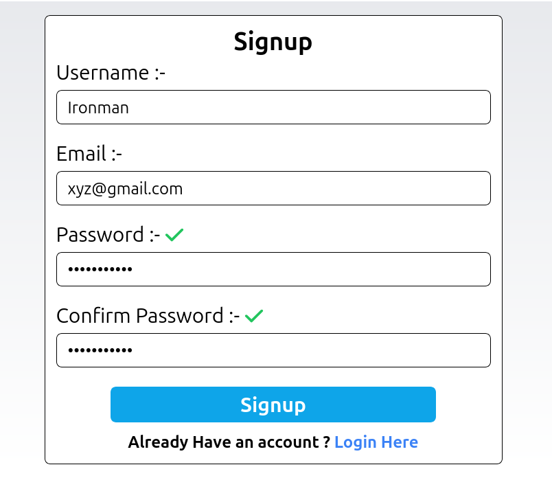

#  Next.js Authentication Project

Welcome to  Next.js authentication project! This application features user authentication, styled with Tailwind CSS, and integrates a MongoDB database.

## Table of Contents

- [Next.js Authentication Project](#nextjs-authentication-project)
  - [Table of Contents](#table-of-contents)
  - [Features](#features)
  - [ScreenShots](#screenshots)
    - [1. Home Page :- This is Home Page of User authentication Project.](#1-home-page---this-is-home-page-of-user-authentication-project)
    - [2. Sign Up :- This is Signup Page of User authentication Project.](#2-sign-up---this-is-signup-page-of-user-authentication-project)
    - [3. Login :- This is Login Page of User authentication Project.](#3-login---this-is-login-page-of-user-authentication-project)

## Features

- User authentication (sign up, login, logout,verify email , forgot password)
- MongoDB integration for user data storage
- Tailwind CSS for responsive and modern design
- Server-side rendering and static site generation

## ScreenShots

### 1. Home Page :- This is Home Page of User authentication Project.
   

### 2. Sign Up :- This is Signup Page of User authentication Project.  

### 3. Login :- This is Login Page of User authentication Project.

